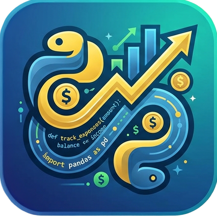
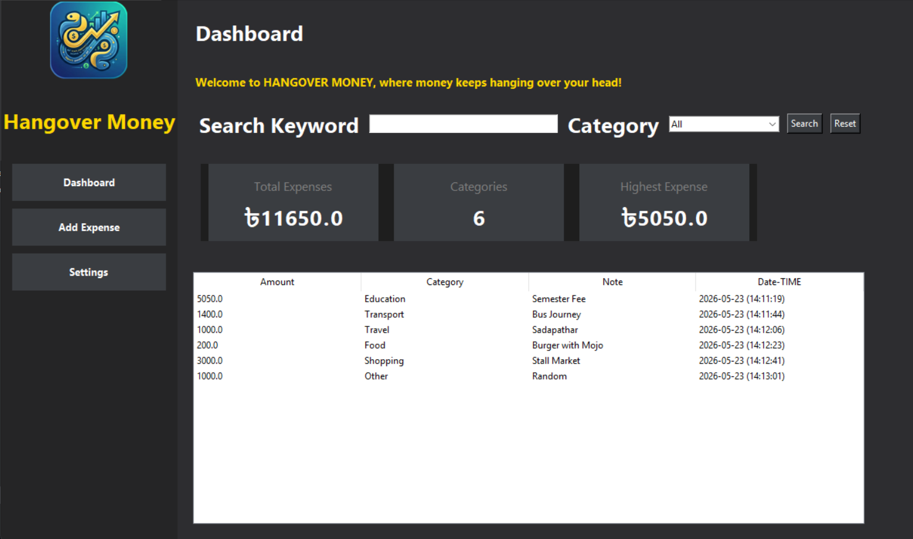
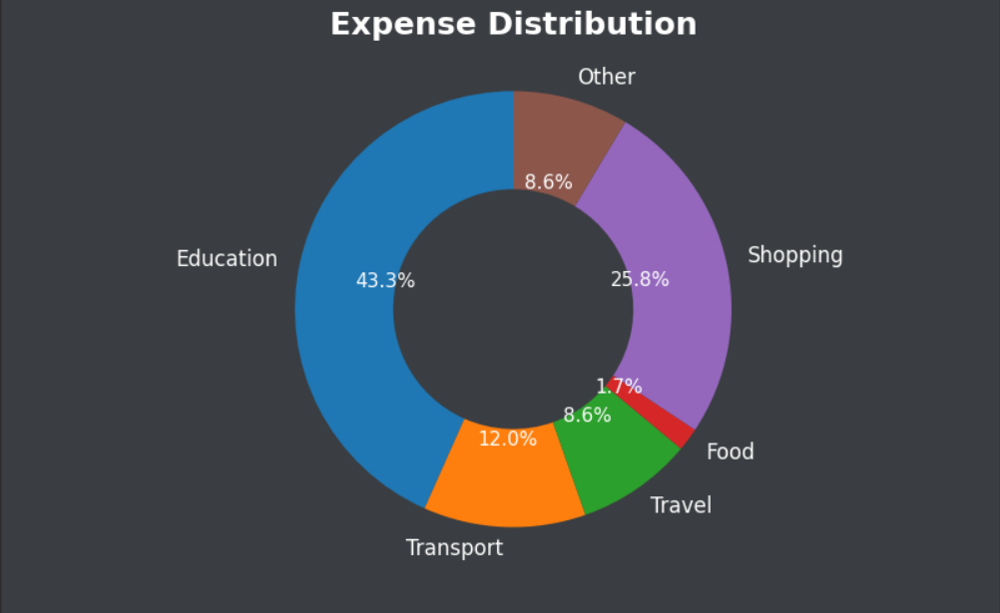
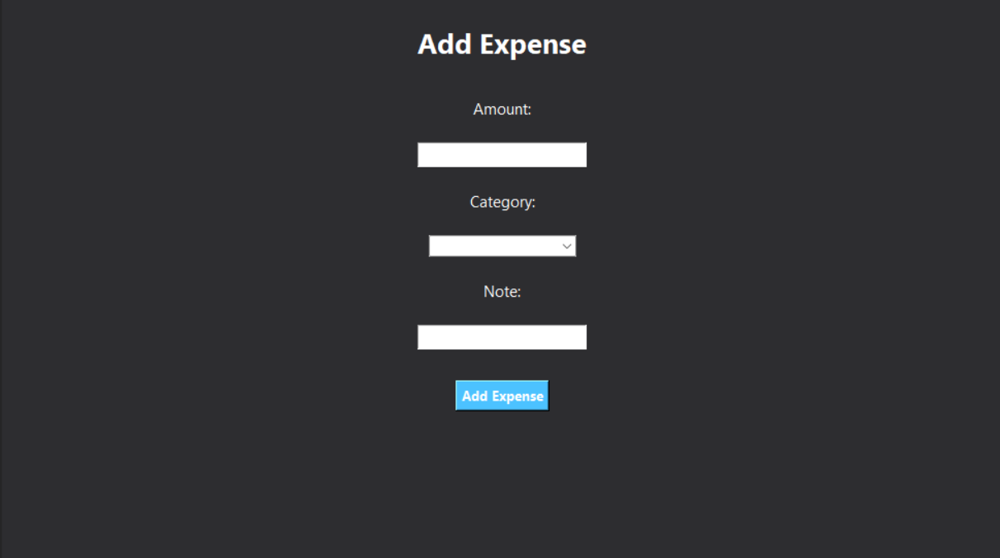
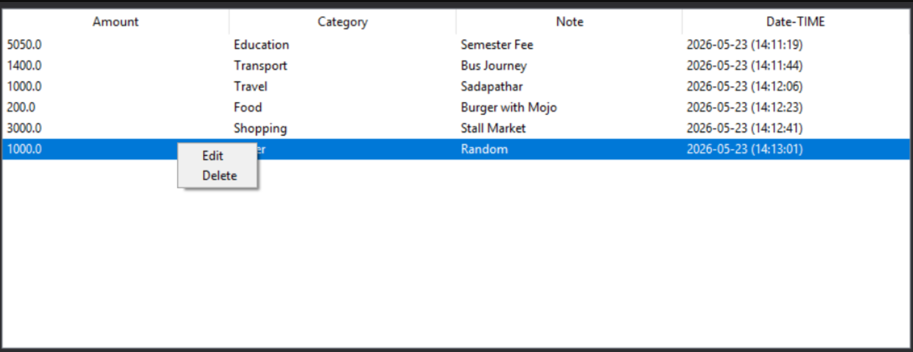
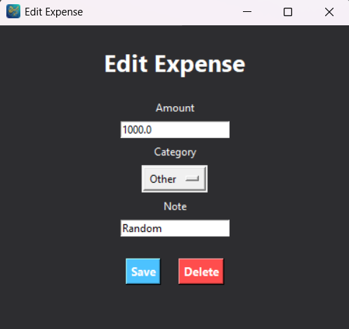
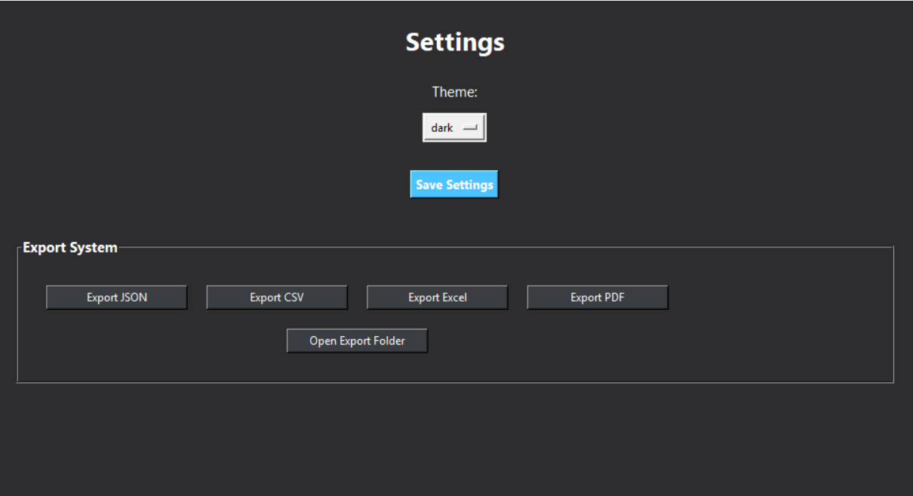

# 💸 Hangover Money

A modern desktop expense tracker built with Python and Tkinter.

Track expenses, analyze spending, export reports, and manage your finances with a clean modern GUI.

## 📸 Screenshots















## ✨ Features

- Add, edit, and delete expenses
- Search and filter system
- Category management
- Live dashboard updates
- Donut chart analytics
- Export to JSON, CSV, Excel, and PDF
- Modern toast notifications
- Theme system
- Auto-refresh dashboard
- Scrollable UI

## 🛠 Built With

- Python
- Tkinter
- Matplotlib
- Pandas
- OpenPyXL
- ReportLab
- Pillow

## ⚙ Installation

```bash
git clone https://github.com/saki-saki09/HangoverMoney.git

cd hangover-money

py -m venv .venv

.venv\Scripts\activate

pip install -r requirements.txt

py main.py
```

## 📂 Project Structure

```text
Hangover Money/
│
├── assets/
├── data/
├── exports/
├── gui/
├── modules/
├── utils/
│
├── main.py
├── requirements.txt
└── README.md
```

## 🚀 Upcoming Features

- SQLite database support
- Budget goals
- Cloud sync
- AI spending analysis
- Receipt scanner OCR
- Mobile companion app

## 👨‍💻 Author

Developed by SAKIBUL HOQUE SAKI

## 📄 License

This project is licensed under the MIT License.


